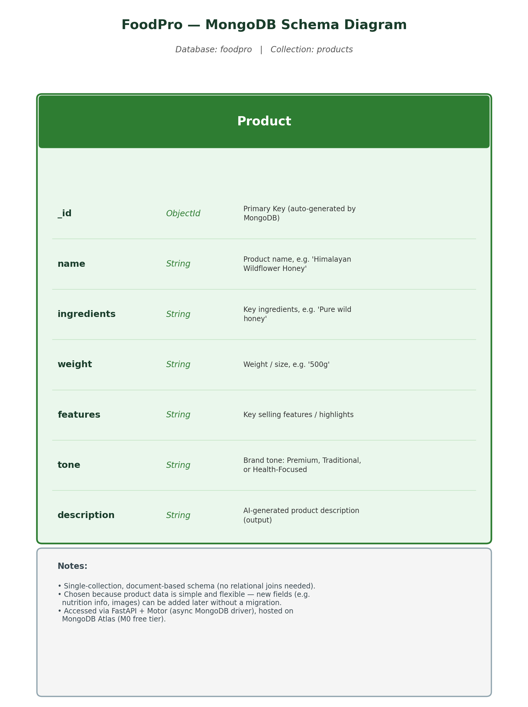

# FoodPro — AI-Powered Product Description Generator

FoodPro uses AI to generate keyword-rich, e-commerce-ready product descriptions for HimShakti's food products — instantly.

## Tech Stack

- **Frontend:** React + Vite + Tailwind CSS (in `foodpro-frontend`)
- **Backend:** FastAPI (Python)
- **Database:** MongoDB (via MongoDB Atlas)

## Features

- Generate AI-written product descriptions based on product name, ingredients, weight, and key features
- Choose a brand tone: Premium, Traditional, or Health-Focused
- Full CRUD (Create, Read, Update, Delete) support, backed by MongoDB

## Database

### Choice: MongoDB (via MongoDB Atlas)

FoodPro uses **MongoDB**, hosted on **MongoDB Atlas** (M0 free tier).

MongoDB was chosen over a relational database because:
- Product data is simple and flat, without a need for complex joins across tables.
- The schema may evolve over time (e.g. adding nutrition info or product images), and MongoDB's flexible document structure makes this easy without migrations.
- It pairs naturally with the FastAPI + Motor async stack already used in this project.

### Schema Diagram



The database has a single collection, **`products`**, with the following fields:

| Field         | Type     | Description                                              |
|---------------|----------|------------------------------------------------------------|
| `_id`         | ObjectId | Primary key, auto-generated by MongoDB                    |
| `name`        | String   | Product name                                               |
| `ingredients` | String   | Key ingredients                                             |
| `weight`      | String   | Weight / size (e.g. "500g")                                |
| `features`    | String   | Key selling features / highlights                          |
| `tone`        | String   | Brand tone: `Premium`, `Traditional`, or `Health-Focused`   |
| `description` | String   | AI-generated product description                           |

### Set Up the Database

1. Create a free MongoDB Atlas account and cluster at [mongodb.com/cloud/atlas](https://mongodb.com/cloud/atlas).
2. Under Atlas → Network Access, whitelist your IP address.
3. Under Atlas → Database Access, create a database user (username + password).
4. Under Atlas → Connect → Drivers, copy your connection string.
5. Create a `.env` file (never commit this) with:
6. Install backend dependencies:
```bash
   pip install fastapi uvicorn motor pymongo python-dotenv certifi
```
7. Run the backend:
```bash
   uvicorn main:app --reload
```

See `.env.example` for the required variable format with placeholder values.

## Running the Frontend

```bash
cd foodpro-frontend
npm install
npm run dev
```

## Project Status

Week 5 — Database integration complete (MongoDB Atlas + full CRUD via FastAPI/Motor).