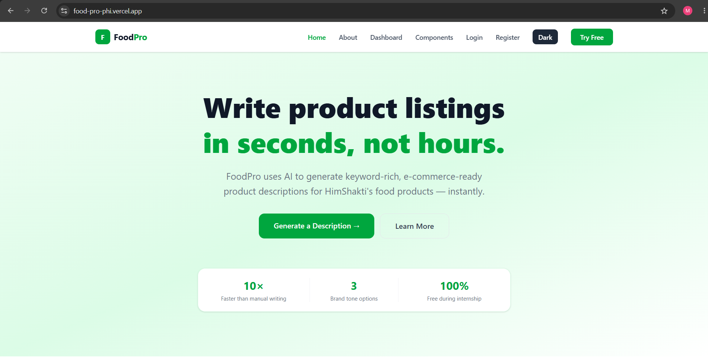
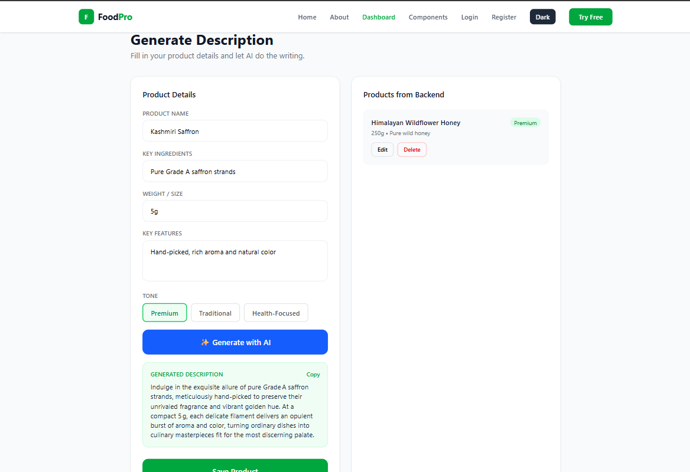
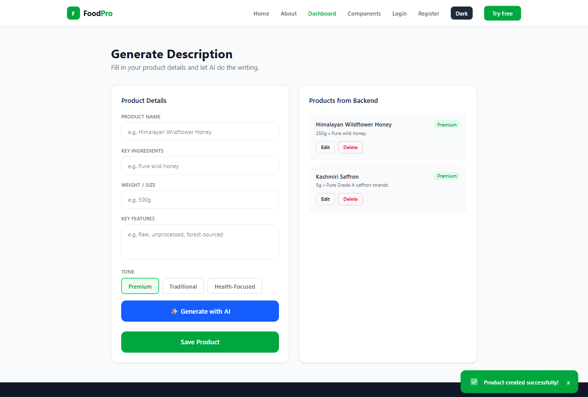

# FoodPro

AI-powered product description generator built for HimShakti, a food processing brand selling on e-commerce platforms like Amazon.

## Live Demo

- **App:** https://food-pro-phi.vercel.app
- **API:** https://foodpro-gd9i.onrender.com

## Demo Video

🎥 [Watch the demo video](https://youtu.be/AL-MUbQbeKs?si=7K6ebsgGxR487w9c)

## Screenshots





## Features

- User registration and login secured with JWT authentication and bcrypt password hashing
- Rate limiting on auth endpoints (5 requests/min) to prevent brute-force attempts
- Full CRUD for products — create, view, edit, and delete
- AI-generated product descriptions (name, ingredients, weight, features, and tone as inputs)
- Product search by name or tone
- One-click copy of generated descriptions
- Responsive UI (tested at 375px, 768px, and 1440px) with dark/light mode toggle
- Protected routes — unauthenticated users are redirected to login
- Error boundaries for graceful failure handling
- Empty-state UI for a new user with no products yet

## Tech Stack

| Layer | Technology |
|---|---|
| Frontend | React + Vite, Tailwind CSS |
| Backend | FastAPI (Python) |
| Database | MongoDB Atlas (via Motor async driver) |
| AI | Hugging Face Inference API (`openai/gpt-oss-120b` via Cerebras provider) |
| Auth | JWT (python-jose) + bcrypt (passlib) |
| Deployment | Vercel (frontend) + Render (backend) |

## Setup Instructions

### Prerequisites
- Node.js and npm
- Python 3.x
- A MongoDB Atlas connection string
- A Gemini API key

### 1. Clone the repo
```bash
git clone https://github.com/<your-username>/<your-repo>.git
cd <your-repo>
```

### 2. Backend setup
```bash
pip install -r requirements.txt
```
Create a `.env` file in the repo root with:
```
MONGO_URI=your_mongodb_connection_string
JWT_SECRET=your_jwt_signing_secret
HF_API_TOKEN=your_hugging_face_api_token
```
Run the backend:
```bash
python -m uvicorn main:app --reload
```

### 3. Frontend setup
```bash
cd foodpro-frontend
npm install
```
Create a `.env` file in `foodpro-frontend/` with:
```
VITE_API_URL=http://127.0.0.1:8000
```
Run the frontend:
```bash
npm run dev
```

## API Documentation

| Method | Endpoint | Description | Auth Required |
|---|---|---|---|
| GET | `/` | Health check | No |
| POST | `/api/auth/register` | Create a new user account (rate limited: 5/min) | No |
| POST | `/api/auth/login` | Authenticate and receive a JWT (rate limited: 5/min) | No |
| GET | `/api/auth/me` | Get the current authenticated user | Yes |
| GET | `/api/products` | List the current user's products | Yes |
| POST | `/api/products` | Create a new product | Yes |
| PUT | `/api/products/{product_id}` | Update a product (owner only) | Yes |
| DELETE | `/api/products/{product_id}` | Delete a product (owner only) | Yes |
| GET | `/api/products/search/query?q=` | Search products by name or tone | No |
| GET | `/api/tones` | List available description tones | No |
| POST | `/api/ai/generate-description` | Generate an AI product description (rate limited: 10/min) | Yes |

**Example — Login**
```
POST /api/auth/login
Body: { "email": "user@example.com", "password": "yourpassword" }
Response: { "status": "success", "data": { "token": "<jwt>", "email": "user@example.com" } }
```

**Example — Generate AI Description**
```
POST /api/ai/generate-description
Body: {
  "name": "Himalayan Wildflower Honey",
  "ingredients": "Pure wild honey",
  "weight": "500g",
  "features": "Raw, unprocessed, forest-sourced",
  "tone": "Premium"
}
Response: { "status": "success", "data": { "description": "..." } }
```

## Architecture / Folder Structure

The backend is a single-file FastAPI app (`main.py`) at the repo root — it handles routing, auth, password hashing, JWT issuance, and the AI call directly, with no separate routers/services layer. The frontend lives in its own subfolder.

<!-- TODO: confirm the frontend subtree below is accurate — run
     `tree -L 2 -I node_modules foodpro-frontend` and paste the real output if it differs -->

```
.
├── main.py                  # FastAPI app: routes, auth (JWT + bcrypt), Mongo models, AI call
├── requirements.txt
├── foodpro-frontend/        # React + Vite frontend
│   ├── src/
│   │   ├── components/
│   │   │   └── ui/          # Button, Input, Modal, Toast, Loader
│   │   ├── pages/           # Home, About, Dashboard, Login, Register
│   │   └── App.jsx
│   └── vercel.json          # SPA routing rewrite rule
└── README.md
```

## Known Limitations

- Render free-tier backend spins down after 15 minutes of inactivity — the first request after idle time can take 30-60 seconds to respond
- GitHub OAuth UI exists on the frontend (`OAuthSuccess.jsx`) but the corresponding backend routes were never implemented, so this flow does not currently work
- MongoDB Atlas network access is set to allow all IPs (`0.0.0.0/0`) for development convenience — would be restricted in a production deployment
- No automated test suite yet — testing has been manual, endpoint-by-endpoint

## Credits & Acknowledgements

- Built as part of the **TBI-GEU SIP 2026 AI-Assisted Full Stack Web Development** internship program
- AI assistance used throughout development (Claude) for debugging, architecture decisions, and documentation
- Product descriptions generated using Google's **Gemini API**
